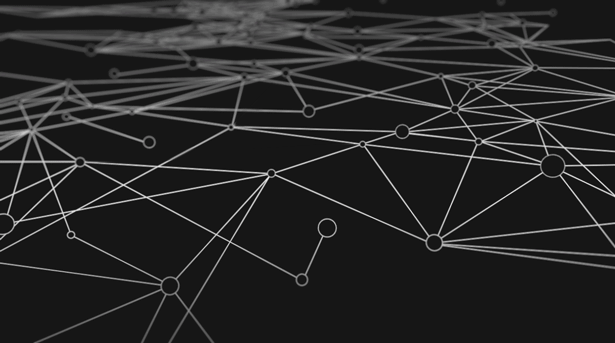

# Grafos
Representação e algoritmos computacionais para Grafos.

* Lista de Adjacências
* Matriz de Adjacências
* Busca em largura e profundidade
* Algoritmo de Dijkstra
* Algoritmo de Prim
* Algoritmo Húngaro
* Algoritmo de Tarjan
* Algoritmo de Componentes Conexas
* Biblioteca NetworkX  

